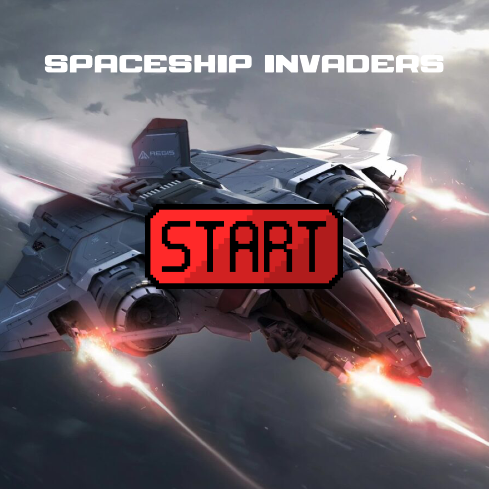
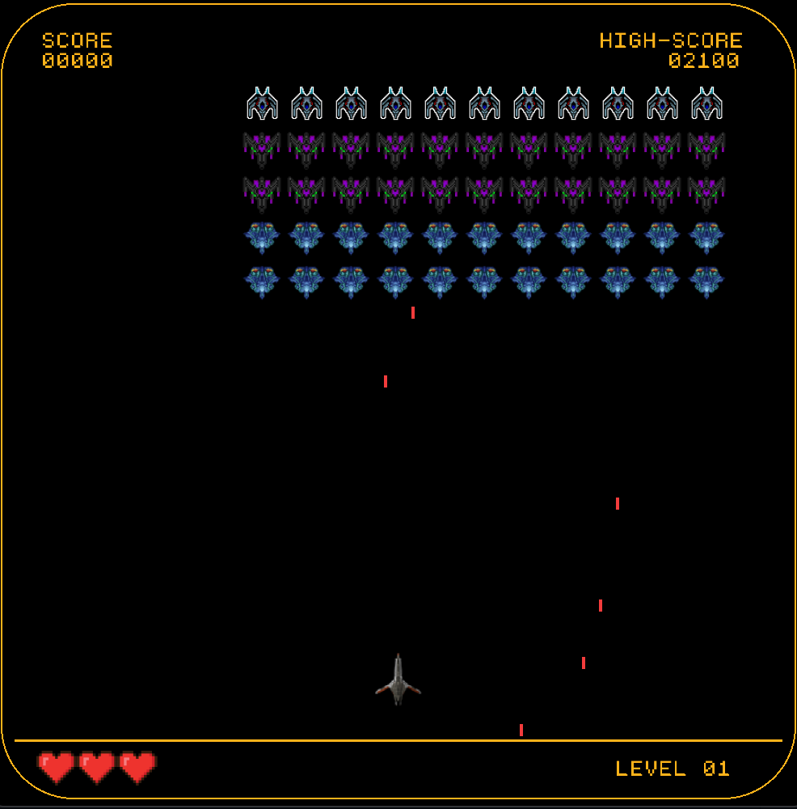

# Spaceship Invaders

A retro-style 2D space shooter game created with Raylib and C++. Defend Earth against waves of alien invaders in this classic arcade-inspired game.

## Table of Contents

- [Demo](#demo)
- [Features](#features)
- [File Structure](#file-structure)
- [Requirements](#requirements)
- [Installation](#installation)

## Demo

Use space key to Laser the alien and Press Enter to Restart

 

## Features

- Classic space shooter gameplay
- Multiple enemy types
- Score tracking system
- Retro-style graphics and sound effects
- Smooth controls and animations

## File Structure

```
/SpaceshipInvaders
│
├── .vscode/                    # VSCode configuration files
│   ├── c_cpp_properties.json
│   ├── launch.json
│   └── tasks.json
│
├── Fonts/                      # Font files
│   ├── monogram.ttf
│   └── SPACE.ttf
│
├── Graphics/                   # Graphic assets
│
├── lib/                        # Library files
│   ├── libgcc_s_dw2-1.dll
│   └── libstdc++-6.dll
│
├── Sounds/                     # Sound files
│
├── src/                        # Source files
│   ├── alien.cpp
│   ├── alien.hpp
│   ├── block.cpp
│   ├── block.hpp
│   ├── game.cpp
│   ├── game.hpp
│   ├── laser.cpp
│   ├── laser.hpp
│   ├── main.cpp
│   ├── mainmenu.cpp
│   ├── mainmenu.hpp
│   ├── obstacle.cpp
│   ├── obstacle.hpp
│   ├── Spaceship.cpp
│   └── Spaceship.hpp
│
├── .gitattributes              # Git attributes file
├── .gitignore                  # Git ignore file
├── Makefile                    # Build file for compiling the project
├── README.md                   # Documentation for the project
├── highscore.txt               # Highscore data file
├── main.code-workspace         # VSCode workspace configuration
├── alien.exe                   # Compiled executable for alien
├── ball.exe                    # Compiled executable for ball
├── game.exe                    # Compiled executable for game
├── main.exe                    # Compiled executable for main
└── mainmenu.exe                # Compiled executable for main menu
```

## Requirements

- C++ compiler
- Raylib library
- CMake (for building)
- Windows 10/11

## Installation

1. Clone the repository:
```git clone https://github.com/MarcusMQF/SpaceShip-Game-with-Raylib.git```

2. Install Raylib library:
   - Download from [Raylib official website](https://www.raylib.com/)
   - Follow installation instructions for your platform