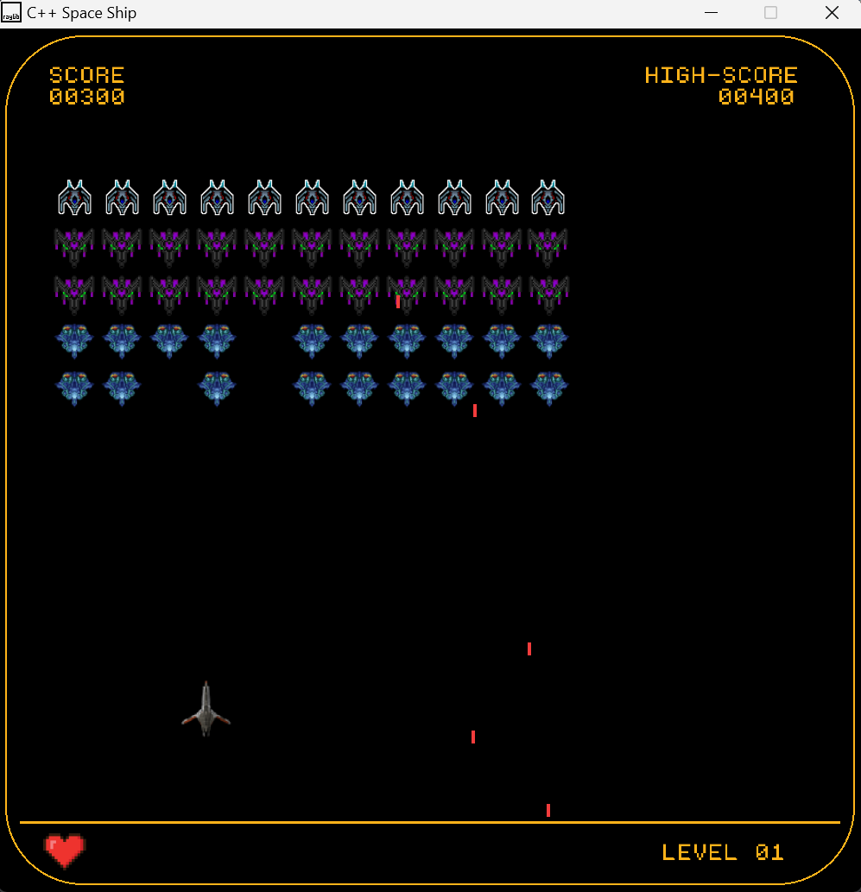

# Create a Game with Raylib C++ 

This Game is created by using Raylib version 4.5 (work on window 10 and 11)

Raylib can [download from here](https://www.raylib.com/)

# Raylib Templete Setup in Vscode

Check This [Repository](https://github.com/educ8s/Raylib-CPP-Starter-Template-for-VSCODE-V2) in Github
He makes life easy a lot!

# Demo

 

